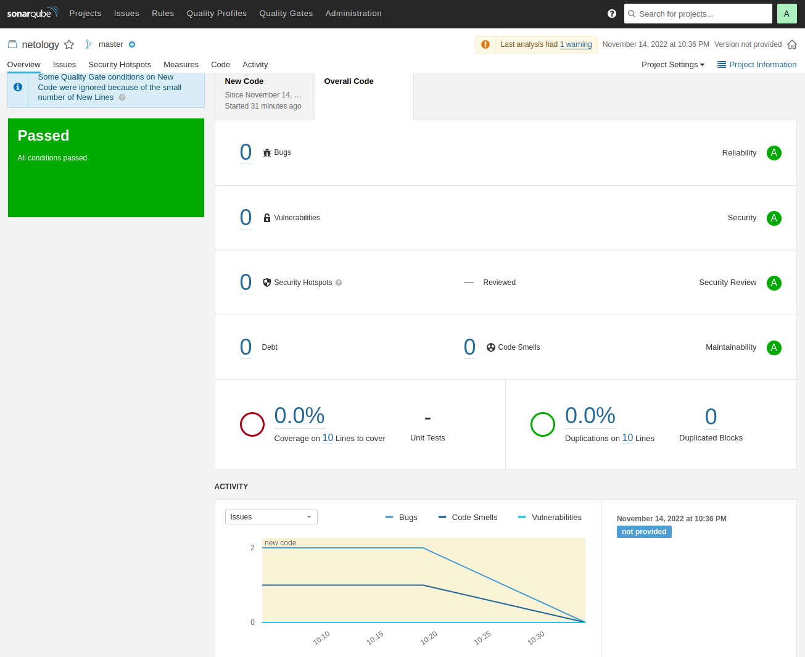
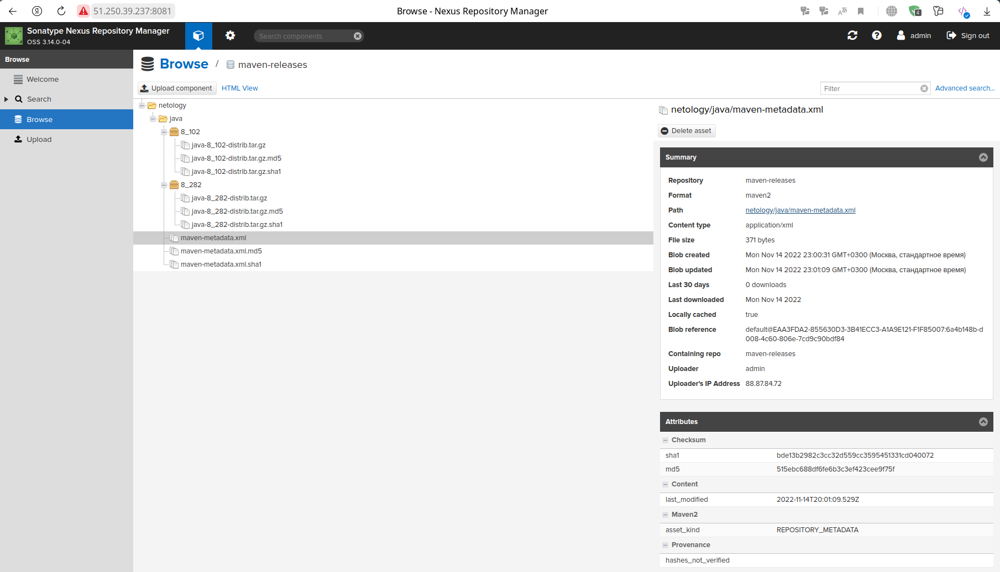

# Домашнее задание к занятию "09.03 CI\CD"

## Подготовка к выполнению

1. Создаём 2 VM в yandex cloud со следующими параметрами: 2CPU 4RAM Centos7(остальное по минимальным требованиям)
2. Прописываем в [inventory](./infrastructure/inventory/cicd/hosts.yml) [playbook'a](./infrastructure/site.yml) созданные хосты
3. Добавляем в [files](./infrastructure/files/) файл со своим публичным ключом (id_rsa.pub). Если ключ называется иначе - найдите таску в плейбуке, которая использует id_rsa.pub имя и исправьте на своё
4. Запускаем playbook, ожидаем успешного завершения
5. Проверяем готовность Sonarqube через [браузер](http://localhost:9000)
6. Заходим под admin\admin, меняем пароль на свой
7.  Проверяем готовность Nexus через [бразуер](http://localhost:8081)
8. Подключаемся под admin\admin123, меняем пароль, сохраняем анонимный доступ

```bash
antigen@gramm:~/netology/devops-netology/AnsibleCICD/CI/CI-03-CICD/src/terraform$ terraform apply --auto-approve
...
Outputs:

external_ip_address_nodes = {
  "nexus-01" = "51.250.39.237"
  "sonar-01" = "51.250.42.167"
}
internal_ip_address_nodes = {
  "nexus-01" = "172.16.5.26"
  "sonar-01" = "172.16.5.18"
}

antigen@gramm:~/netology/devops-netology/AnsibleCICD/CI/CI-03-CICD/src/infrastructure$ ansible-playbook site.yml -i inventory/cicd/hosts.yml
...
PLAY RECAP *************************************************************************************************************************************************************************************************************
nexus-01                   : ok=17   changed=15   unreachable=0    failed=0    skipped=2    rescued=0    ignored=0   
sonar-01                   : ok=35   changed=27   unreachable=0    failed=0    skipped=0    rescued=0    ignored=0   
```

## Знакомоство с SonarQube

### Основная часть

1. Создаём новый проект, название произвольное
2. Скачиваем пакет sonar-scanner, который нам предлагает скачать сам sonarqube
3. Делаем так, чтобы binary был доступен через вызов в shell (или меняем переменную PATH или любой другой удобный вам способ)
4. Проверяем `sonar-scanner --version`
5. Запускаем анализатор против кода из директории [example](./example) с дополнительным ключом `-Dsonar.coverage.exclusions=fail.py`
6. Смотрим результат в интерфейсе
7. Исправляем ошибки, которые он выявил(включая warnings)
8. Запускаем анализатор повторно - проверяем, что QG пройдены успешно
9. Делаем скриншот успешного прохождения анализа, прикладываем к решению ДЗ

### Ответ
4. Проверяем:
```bash
antigen@gramm:~/netology/devops-netology/AnsibleCICD/CI/CI-03-CICD/src/infrastructure$ sonar-scanner --version
INFO: Scanner configuration file: /opt/sonar-scanner/4.7.0.2747/conf/sonar-scanner.properties
INFO: Project root configuration file: NONE
INFO: SonarScanner 4.7.0.2747
INFO: Java 11.0.14.1 Eclipse Adoptium (64-bit)
INFO: Linux 5.10.0-19-amd64 amd64
```
8. Итоговый вариант команды:
```bash
sonar-scanner \
    --define sonar.projectKey=netology \
    --define sonar.sources=. \
    --define sonar.host.url=http://51.250.42.167:9000 \
    --define sonar.login=93ebf6c2270f8e3f6144f4b8b63faa6b5f377a2a \
    --define sonar.coverage.exclusion=fail.py --define sonar.python.version=3
```
Токен (sonar.login) берем из инструкции [тут](https://docs.sonarqube.org/latest/user-guide/user-token/)

9. Результат:
```bash
antigen@gramm:~/netology/devops-netology/AnsibleCICD/CI/CI-03-CICD/src/example$ sonar-scanner --define sonar.projectKey=netology --define sonar.sources=. --define sonar.host.url=http://51.250.42.167:9000 --define sonar.login=93ebf6c2270f8e3f6144f4b8b63faa6b5f377a2a --define sonar.coverage.exclusion=fail.py --define sonar.python.version=3
INFO: Scanner configuration file: /opt/sonar-scanner/4.7.0.2747/conf/sonar-scanner.properties
INFO: Project root configuration file: NONE
INFO: SonarScanner 4.7.0.2747
INFO: Java 11.0.14.1 Eclipse Adoptium (64-bit)
INFO: Linux 5.10.0-19-amd64 amd64
INFO: User cache: /home/antigen/.sonar/cache
INFO: Scanner configuration file: /opt/sonar-scanner/4.7.0.2747/conf/sonar-scanner.properties
INFO: Project root configuration file: NONE
INFO: Analyzing on SonarQube server 9.1.0
INFO: Default locale: "ru_RU", source code encoding: "UTF-8" (analysis is platform dependent)
INFO: Load global settings
INFO: Load global settings (done) | time=274ms
INFO: Server id: 9CFC3560-AYR3YJXYYX3Y51se4Rop
INFO: User cache: /home/antigen/.sonar/cache
INFO: Load/download plugins
INFO: Load plugins index
INFO: Load plugins index (done) | time=81ms
INFO: Load/download plugins (done) | time=185ms
INFO: Process project properties
INFO: Process project properties (done) | time=10ms
INFO: Execute project builders
INFO: Execute project builders (done) | time=1ms
INFO: Project key: netology
INFO: Base dir: /home/antigen/netology/devops-netology/AnsibleCICD/CI/CI-03-CICD/src/example
INFO: Working dir: /home/antigen/netology/devops-netology/AnsibleCICD/CI/CI-03-CICD/src/example/.scannerwork
INFO: Load project settings for component key: 'netology'
INFO: Load project settings for component key: 'netology' (done) | time=52ms
INFO: Load quality profiles
INFO: Load quality profiles (done) | time=117ms
INFO: Load active rules
INFO: Load active rules (done) | time=2951ms
INFO: Indexing files...
INFO: Project configuration:
INFO: 1 file indexed
INFO: 0 files ignored because of scm ignore settings
INFO: Quality profile for py: Sonar way
INFO: ------------- Run sensors on module netology
INFO: Load metrics repository
INFO: Load metrics repository (done) | time=79ms
INFO: Sensor Python Sensor [python]
INFO: Starting global symbols computation
INFO: 1 source file to be analyzed
INFO: Load project repositories
INFO: Load project repositories (done) | time=49ms
INFO: 1/1 source file has been analyzed
INFO: Starting rules execution
INFO: 1 source file to be analyzed
INFO: 1/1 source file has been analyzed
INFO: Sensor Python Sensor [python] (done) | time=877ms
INFO: Sensor Cobertura Sensor for Python coverage [python]
INFO: Sensor Cobertura Sensor for Python coverage [python] (done) | time=10ms
INFO: Sensor PythonXUnitSensor [python]
INFO: Sensor PythonXUnitSensor [python] (done) | time=0ms
INFO: Sensor CSS Rules [cssfamily]
INFO: No CSS, PHP, HTML or VueJS files are found in the project. CSS analysis is skipped.
INFO: Sensor CSS Rules [cssfamily] (done) | time=0ms
INFO: Sensor JaCoCo XML Report Importer [jacoco]
INFO: 'sonar.coverage.jacoco.xmlReportPaths' is not defined. Using default locations: target/site/jacoco/jacoco.xml,target/site/jacoco-it/jacoco.xml,build/reports/jacoco/test/jacocoTestReport.xml
INFO: No report imported, no coverage information will be imported by JaCoCo XML Report Importer
INFO: Sensor JaCoCo XML Report Importer [jacoco] (done) | time=5ms
INFO: Sensor C# Project Type Information [csharp]
INFO: Sensor C# Project Type Information [csharp] (done) | time=1ms
INFO: Sensor C# Analysis Log [csharp]
INFO: Sensor C# Analysis Log [csharp] (done) | time=21ms
INFO: Sensor C# Properties [csharp]
INFO: Sensor C# Properties [csharp] (done) | time=0ms
INFO: Sensor JavaXmlSensor [java]
INFO: Sensor JavaXmlSensor [java] (done) | time=2ms
INFO: Sensor HTML [web]
INFO: Sensor HTML [web] (done) | time=3ms
INFO: Sensor VB.NET Project Type Information [vbnet]
INFO: Sensor VB.NET Project Type Information [vbnet] (done) | time=1ms
INFO: Sensor VB.NET Analysis Log [vbnet]
INFO: Sensor VB.NET Analysis Log [vbnet] (done) | time=19ms
INFO: Sensor VB.NET Properties [vbnet]
INFO: Sensor VB.NET Properties [vbnet] (done) | time=0ms
INFO: ------------- Run sensors on project
INFO: Sensor Zero Coverage Sensor
INFO: Sensor Zero Coverage Sensor (done) | time=8ms
INFO: SCM Publisher SCM provider for this project is: git
INFO: SCM Publisher 1 source file to be analyzed
INFO: SCM Publisher 1/1 source file have been analyzed (done) | time=186ms
INFO: CPD Executor Calculating CPD for 1 file
INFO: CPD Executor CPD calculation finished (done) | time=11ms
INFO: Analysis report generated in 104ms, dir size=102,9 kB
INFO: Analysis report compressed in 27ms, zip size=14,2 kB
INFO: Analysis report uploaded in 80ms
INFO: ANALYSIS SUCCESSFUL, you can browse http://51.250.42.167:9000/dashboard?id=netology
INFO: Note that you will be able to access the updated dashboard once the server has processed the submitted analysis report
INFO: More about the report processing at http://51.250.42.167:9000/api/ce/task?id=AYR3lqKZYX3Y51se4Wt5
INFO: Analysis total time: 6.909 s
INFO: ------------------------------------------------------------------------
INFO: EXECUTION SUCCESS
INFO: ------------------------------------------------------------------------
INFO: Total time: 8.799s
INFO: Final Memory: 8M/34M
INFO: ------------------------------------------------------------------------
```

## Знакомство с Nexus

### Основная часть

1. В репозиторий `maven-releases` загружаем артефакт с GAV параметрами:
   1. groupId: netology
   2. artifactId: java
   3. version: 8_282
   4. classifier: distrib
   5. type: tar.gz
2. В него же загружаем такой же артефакт, но с version: 8_102
3. Проверяем, что все файлы загрузились успешно
4. В ответе присылаем файл `maven-metadata.xml` для этого артефекта

### Ответ


[maven-metadata.xml](src/mvn/maven-metadata.xml)
```xml
<?xml version="1.0" encoding="UTF-8"?>
<metadata modelVersion="1.1.0">
  <groupId>netology</groupId>
  <artifactId>java</artifactId>
  <versioning>
    <latest>8_282</latest>
    <release>8_282</release>
    <versions>
      <version>8_102</version>
      <version>8_282</version>
    </versions>
    <lastUpdated>20221114200109</lastUpdated>
  </versioning>
</metadata>
```

### Знакомство с Maven

### Подготовка к выполнению

1. Скачиваем дистрибутив с [maven](https://maven.apache.org/download.cgi)
2. Разархивируем, делаем так, чтобы binary был доступен через вызов в shell (или меняем переменную PATH или любой другой удобный вам способ)
3. Удаляем из `apache-maven-<version>/conf/settings.xml` упоминание о правиле, отвергающем http соединение( раздел mirrors->id: my-repository-http-blocker)
4. Проверяем `mvn --version`
5. Забираем директорию [mvn](./mvn) с pom

```bash
antigen@gramm:~/netology/devops-netology/AnsibleCICD/CI/CI-03-CICD/src$ mvn --version
Apache Maven 3.8.6 (84538c9988a25aec085021c365c560670ad80f63)
Maven home: /opt/maven/3.8.6
Java version: 17.0.4, vendor: Debian, runtime: /usr/lib/jvm/java-17-openjdk-amd64
Default locale: ru_RU, platform encoding: UTF-8
OS name: "linux", version: "5.10.0-19-amd64", arch: "amd64", family: "unix"
```

### Основная часть

1. Меняем в `pom.xml` блок с зависимостями под наш артефакт из первого пункта задания для Nexus (java с версией 8_282)
2. Запускаем команду `mvn package` в директории с `pom.xml`, ожидаем успешного окончания
3. Проверяем директорию `~/.m2/repository/`, находим наш артефакт
4. В ответе присылаем исправленный файл `pom.xml`

```bash
antigen@gramm:~/netology/devops-netology/AnsibleCICD/CI/CI-03-CICD/src/mvn$ mvn package
...
[INFO] Building jar: /home/antigen/netology/devops-netology/AnsibleCICD/CI/CI-03-CICD/src/mvn/target/simple-app-1.0-SNAPSHOT.jar
[INFO] ------------------------------------------------------------------------
[INFO] BUILD SUCCESS
[INFO] ------------------------------------------------------------------------
[INFO] Total time:  29.978 s
[INFO] Finished at: 2022-11-14T23:54:16+03:00
[INFO] ------------------------------------------------------------------------
```
[pom.xml](src/mvn/pom.xml)
```xml
<project xmlns="http://maven.apache.org/POM/4.0.0" xmlns:xsi="http://www.w3.org/2001/XMLSchema-instance"
  xsi:schemaLocation="http://maven.apache.org/POM/4.0.0 http://maven.apache.org/xsd/maven-4.0.0.xsd">
  <modelVersion>4.0.0</modelVersion>
 
  <groupId>com.netology.app</groupId>
  <artifactId>simple-app</artifactId>
  <version>1.0-SNAPSHOT</version>
   <repositories>
    <repository>
      <id>my-repo</id>
      <name>maven-public</name>
      <url>http://51.250.39.237:8081/repository/maven-releases/</url>
    </repository>
  </repositories>
  <dependencies>
    <dependency>
      <groupId>netology</groupId>
      <artifactId>java</artifactId>
      <version>8_282</version>
      <classifier>distrib</classifier>
      <type>tar.gz</type>
    </dependency>
  </dependencies>
</project>
```
