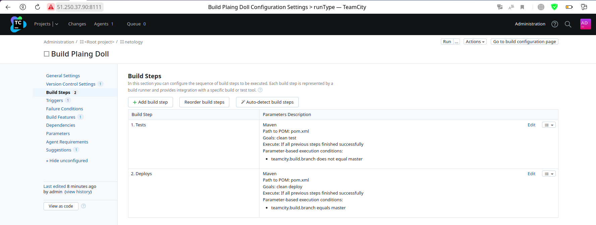
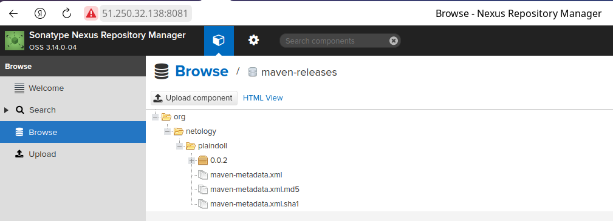
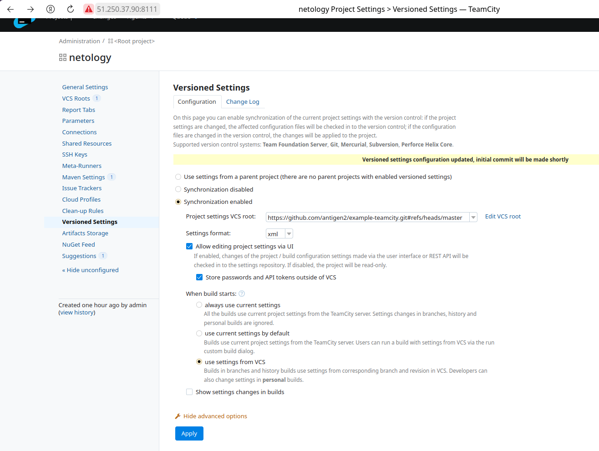
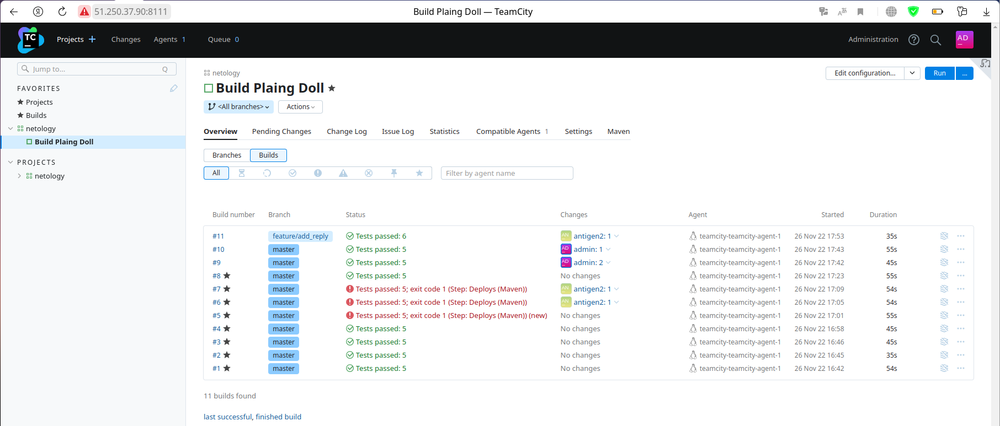
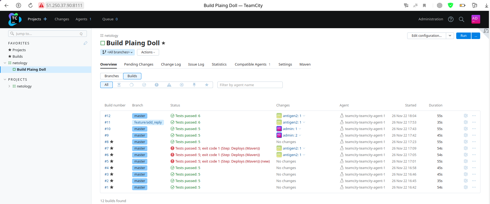
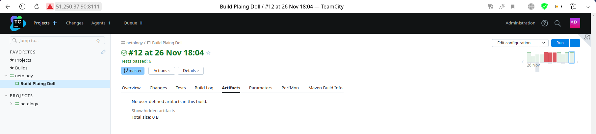
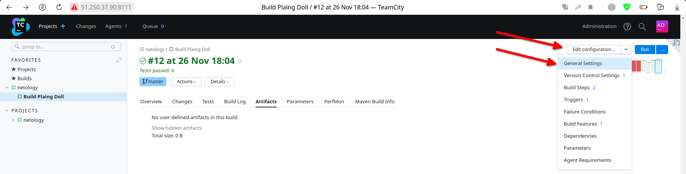
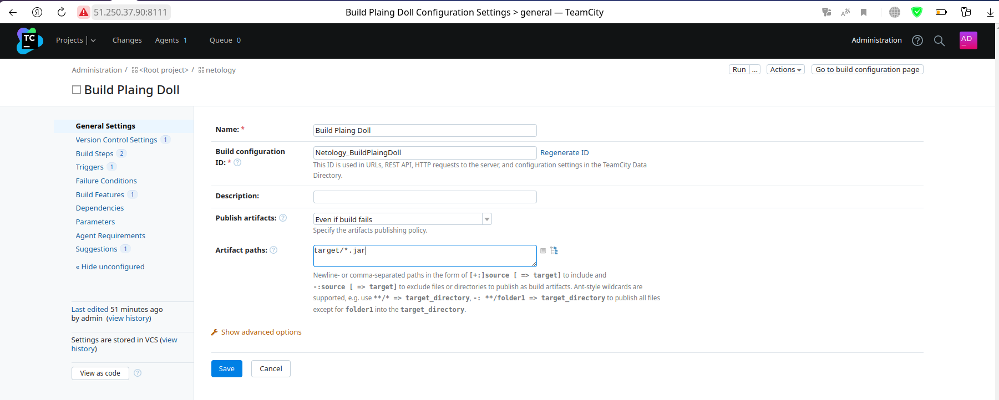
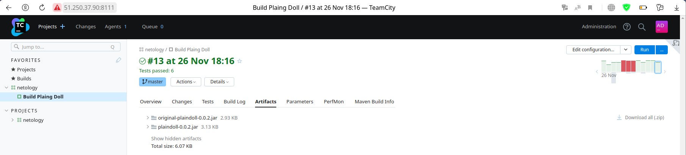

# Домашнее задание к занятию "09.05 Teamcity"

## Подготовка к выполнению

1. В Ya.Cloud создайте новый инстанс (4CPU4RAM) на основе образа `jetbrains/teamcity-server`
2. Дождитесь запуска teamcity, выполните первоначальную настройку
3. Создайте ещё один инстанс(2CPU4RAM) на основе образа `jetbrains/teamcity-agent`. Пропишите к нему переменную окружения `SERVER_URL: "http://<teamcity_url>:8111"`
4. Авторизуйте агент
5. Сделайте fork [репозитория](https://github.com/aragastmatb/example-teamcity)
6. Создать VM (2CPU4RAM) и запустить [playbook](./infrastructure)

```bash
antigen@gramm:~/netology/devops-netology/AnsibleCICD/CI/CI-05-teamcity/src/terraform$ terraform apply --auto-approve
...
Outputs:

nexus = "51.250.32.138"
teamcity = "51.250.37.90"
```
```bash
antigen@gramm:~/netology/devops-netology/AnsibleCICD/CI/CI-05-teamcity/src/ansible$ ansible-playbook docker.yml -i inventory/inventory.yml -vv
...
PLAY RECAP *************************************************************************************************************************************************************************************************************
teamcity-01                : ok=17   changed=11   unreachable=0    failed=0    skipped=0    rescued=0    ignored=0  
```
```bash
antigen@gramm:~/netology/devops-netology/AnsibleCICD/CI/CI-05-teamcity/src/ansible$ ssh centos@51.250.35.253
...
[centos@ef39ss2bkr3dcj1acg1j ~]$ cd /opt/teamcity/
[centos@ef39ss2bkr3dcj1acg1j teamcity]$ ls
agent  data  docker-compose.yml  logs  settings.xml
[centos@ef39ss2bkr3dcj1acg1j teamcity]$ docker-compose up -d
...
[+] Running 2/2
 ⠿ Container teamcity-teamcity-1        Started                                                                                                                                                                    0.7s
 ⠿ Container teamcity-teamcity-agent-1  Started  
```

## Основная часть

1. Создайте новый проект в teamcity на основе fork
2. Сделайте autodetect конфигурации
3. Сохраните необходимые шаги, запустите первую сборку master'a
4. Поменяйте условия сборки: если сборка по ветке `master`, то должен происходит `mvn clean deploy`, иначе `mvn clean test`



5. Для deploy будет необходимо загрузить [settings.xml](./teamcity/settings.xml) в набор конфигураций maven у teamcity, предварительно записав туда креды для подключения к nexus
6. В pom.xml необходимо поменять ссылки на репозиторий и nexus
7. Запустите сборку по master, убедитесь что всё прошло успешно, артефакт появился в nexus



8. Мигрируйте `build configuration` в репозиторий

Мигрирование конфигурации сборки выполняется в настройках проекта, а именно: Project Settings -> Versioned Settings (далее активировать синхронизацию и выбрать VCS)


9. Создайте отдельную ветку `feature/add_reply` в репозитории

```bash
git switch -c feature/add_reply
```

10. Напишите новый метод для класса Welcomer: метод должен возвращать произвольную реплику, содержащую слово `hunter`

```java
	public String sayQuestion(){
		return "HUNTER, hunter, HuNtEr, hUnTeR";
	}
```

11. Дополните тест для нового метода на поиск слова `hunter` в новой реплике

```java
	@Test
	public void welcomerSaysHunter2() {
        assertThat(welcomer.sayQuestion(), containsString("hunter"));
	}
```

12. Сделайте push всех изменений в новую ветку в репозиторий
13. Убедитесь что сборка самостоятельно запустилась, тесты прошли успешно



14. Внесите изменения из произвольной ветки `feature/add_reply` в `master` через `Merge`



15. Убедитесь, что нет собранного артефакта в сборке по ветке `master`



16. Настройте конфигурацию так, чтобы она собирала `.jar` в артефакты сборки




17. Проведите повторную сборку мастера, убедитесь, что сбора прошла успешно и артефакты собраны



18. Проверьте, что конфигурация в репозитории содержит все настройки конфигурации из teamcity
19. В ответ предоставьте ссылку на репозиторий

Ссылка на [example-teamcity](https://github.com/antigen2/example-teamcity)
