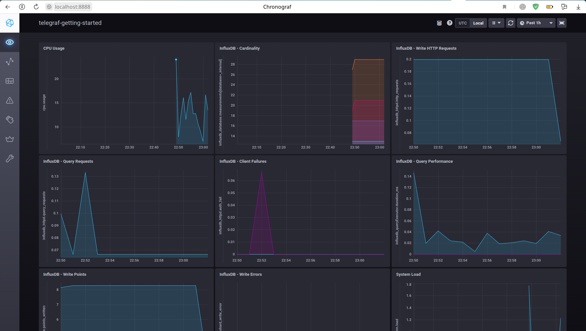
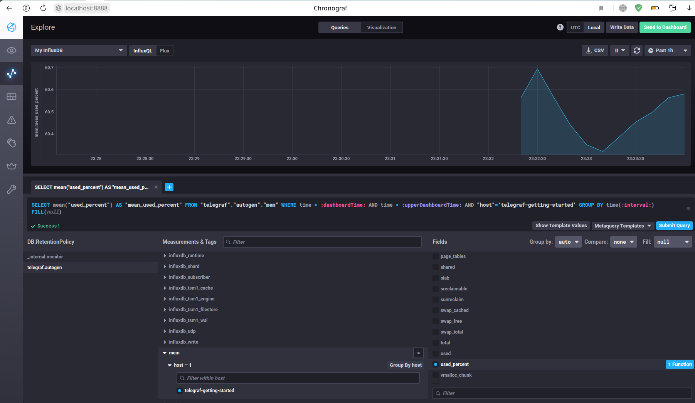

# Домашнее задание к занятию "10.02. Системы мониторинга"

## Обязательные задания

> 1. Опишите основные плюсы и минусы pull и push систем мониторинга.

- В `push` системах агенты на хостах инициируют отправку метрик на сервер
- В `pull` системах сервер сам опрашивает список своих агентов

<table>
   <tr>
      <th></th>
      <th>Плюсы</th>
      <th>Минусы</th>
   </tr>
   <tr>
      <td rowspan="3">push</td>
      <td>Для отправки данных обычно используется протокол `UDP`, что снижает потребление ресурсов на передачу</td>
      <td>При использовании `UDP` возможна потеря пакетов, т.е. метрики могут не доехать до сервера.</td>
   </tr>
   <tr>
      <td>Каждый узел настраивается отдельно. У каждого своя частота отправки метрик и полнота их полнота.</td>
      <td>Нельзя подтвердить принадлежность приходящих данных, т.к. их можно подделать, эмулировав действия агента</td>
   </tr>
   <tr>
      <td>Настройка принемающих серверов происходит на агентах. Это позволяет настроить отправку метрик в несколько систем монтирования.</td>
      <td></td>
   </tr>
   <tr>
      <td rowspan="4">pull</td>
      <td>Для отправки данных обычно используется протокол `TCP`, что снижает вероятность потери метрик</td>
      <td>Т.к. испотльзуется `TCP`, увеличивается потребление ресурсов.</td>
   </tr>
   <tr>
      <td>Гарантируется достоверность всех получаемых метрик</td>
      <td></td>
   </tr>
   <tr>
      <td>Упрощенная отладка получения данных с агентов </td>
      <td></td>
   </tr>
   <tr>
      <td>Создав единый прокси сервер для всех `TLS` агентов можно разнести систему мониторинга и агенты, с гарантией безопасности</td>
      <td></td>
   </tr>
</table>

> 2. Какие из ниже перечисленных систем относятся к push модели, а какие к pull? А может есть гибридные?
> 
>     - Prometheus 
>     - TICK
>     - Zabbix
>     - VictoriaMetrics
>     - Nagios

- `Prometheus` - относится к `pull` модели. При сочитании с `Pushgateway` модель становится `гибридной`
- `TICK` (`Telegraf` + `InfluxDB` + `Chronograf` + `Kapacitor`) - относится к `push` модели, но можнонастроить и как `гибридную`
- `Zabbix` - относится к `гибридной` модели
- `VictoriaMetrics` - относится к `гибридной` модели
- `Nagios` - относится к `pull` модели.

> 3. Склонируйте себе [репозиторий](https://github.com/influxdata/sandbox/tree/master) и запустите TICK-стэк, 
используя технологии docker и docker-compose.
> 
> В виде решения на это упражнение приведите выводы команд с вашего компьютера (виртуальной машины):
> 
>     - curl http://localhost:8086/ping
>     - curl http://localhost:8888
>     - curl http://localhost:9092/kapacitor/v1/ping
> 
> А также скриншот веб-интерфейса ПО chronograf (`http://localhost:8888`). 
> 
> P.S.: если при запуске некоторые контейнеры будут падать с ошибкой - проставьте им режим `Z`, например
`./data:/var/lib:Z`

```bash
antigen@gramm:~/netology/tmp/sandbox-master$ source .env
antigen@gramm:~/netology/tmp/sandbox-master$ ./sandbox 
Using latest, stable releases
sandbox commands:
  up (-nightly)      -> spin up the sandbox environment (latest or nightlies specified in the companion file)
  down               -> tear down the sandbox environment (latest or nightlies specified in the companion file)
  restart (-nightly) -> restart the sandbox
  influxdb           -> attach to the influx cli
  flux               -> attach to the flux REPL

  enter (influxdb||kapacitor||chronograf||telegraf) -> enter the specified container
  logs  (influxdb||kapacitor||chronograf||telegraf) -> stream logs for the specified container

  delete-data  -> delete all data created by the TICK Stack
  docker-clean -> stop and remove all running docker containers and images
  rebuild-docs -> rebuild the documentation image
antigen@gramm:~/netology/tmp/sandbox-master$ ./sandbox up
...

antigen@gramm:~/netology/tmp/sandbox-master$ docker ps -a
CONTAINER ID   IMAGE                          COMMAND                  CREATED         STATUS         PORTS                                                                                                                             NAMES
c23483192e7d   chrono_config                  "/entrypoint.sh chro…"   3 minutes ago   Up 3 minutes   0.0.0.0:8888->8888/tcp, :::8888->8888/tcp                                                                                         sandbox-master_chronograf_1
5ea7037bfbf1   telegraf                       "/entrypoint.sh tele…"   3 minutes ago   Up 3 minutes   8092/udp, 8125/udp, 8094/tcp                                                                                                      sandbox-master_telegraf_1
5678574e083b   kapacitor                      "/entrypoint.sh kapa…"   3 minutes ago   Up 3 minutes   0.0.0.0:9092->9092/tcp, :::9092->9092/tcp                                                                                         sandbox-master_kapacitor_1
ce51461371be   influxdb                       "/entrypoint.sh infl…"   3 minutes ago   Up 3 minutes   0.0.0.0:8082->8082/tcp, :::8082->8082/tcp, 0.0.0.0:8086->8086/tcp, :::8086->8086/tcp, 0.0.0.0:8089->8089/udp, :::8089->8089/udp   sandbox-master_influxdb_1
5d1dbf5331a9   sandbox-master_documentation   "/documentation/docu…"   3 minutes ago   Up 3 minutes   0.0.0.0:3010->3000/tcp, :::3010->3000/tcp                                                                                         sandbox-master_documentation_1
antigen@gramm:~/netology/tmp/sandbox-master$ curl http://localhost:8086/ping
antigen@gramm:~/netology/tmp/sandbox-master$ curl http://localhost:8888
<!DOCTYPE html><html><head><link rel="stylesheet" href="/index.c708214f.css"><meta http-equiv="Content-type" content="text/html; charset=utf-8"><title>Chronograf</title><link rel="icon shortcut" href="/favicon.70d63073.ico"></head><body> <div id="react-root" data-basepath=""></div> <script type="module" src="/index.e81b88ee.js"></script><script src="/index.a6955a67.js" nomodule="" defer></script> </body></html> 
antigen@gramm:~/netology/tmp/sandbox-master$ curl http://localhost:9092/kapacitor/v1/ping
```



> 4. Перейдите в веб-интерфейс Chronograf (`http://localhost:8888`) и откройте вкладку `Data explorer`.
> 
>     - Нажмите на кнопку `Add a query`
>     - Изучите вывод интерфейса и выберите БД `telegraf.autogen`
>     - В `measurments` выберите mem->host->telegraf_container_id , а в `fields` выберите used_percent. 
>     Внизу появится график утилизации оперативной памяти в контейнере telegraf.
>     - Вверху вы можете увидеть запрос, аналогичный SQL-синтаксису. 
>     Поэкспериментируйте с запросом, попробуйте изменить группировку и интервал наблюдений.
> 
> Для выполнения задания приведите скриншот с отображением метрик утилизации места на диске 
> (disk->host->telegraf_container_id) из веб-интерфейса.

Редактируем `telegraf/telegraf.conf`. Вставляем в конфиг строки:
```editorconfig
[[inputs.mem]]
[[inputs.disk]]
  ignore_fs = ["tmpfs", "devtmpfs", "devfs", "iso9660", "overlay", "aufs", "squashfs"]
```
Рестартуем `telegraf` контейнер:
```bash
antigen@gramm:~/netology/tmp/sandbox-master$ docker restart sandbox-master_telegraf_1 
sandbox-master_telegraf_1
```


> 5. Изучите список [telegraf inputs](https://github.com/influxdata/telegraf/tree/master/plugins/inputs). 
> Добавьте в конфигурацию telegraf следующий плагин - [docker](https://github.com/influxdata/telegraf/tree/master/plugins/inputs/docker):
> ```
> [[inputs.docker]]
>   endpoint = "unix:///var/run/docker.sock"
> ```
> 
> Дополнительно вам может потребоваться донастройка контейнера telegraf в `docker-compose.yml` дополнительного volume и 
> режима privileged:
> ```
>   telegraf:
>     image: telegraf:1.4.0
>     privileged: true
>     volumes:
>       - ./etc/telegraf.conf:/etc/telegraf/telegraf.conf:Z
>       - /var/run/docker.sock:/var/run/docker.sock:Z
>     links:
>       - influxdb
>     ports:
>       - "8092:8092/udp"
>       - "8094:8094"
>       - "8125:8125/udp"
> ```
> 
> После настройки перезапустите telegraf, обновите веб интерфейс и приведите скриншотом список `measurments` в 
> веб-интерфейсе базы telegraf.autogen . Там должны появиться метрики, связанные с docker.
> 
> Факультативно можете изучить, какие метрики собирает telegraf после выполнения данного задания.

Все что мог перепробовал, но не появляется пункт `docker`. В логах следующее:
```log
telegraf_1       | 2022-11-30T21:27:20Z E! [inputs.docker] Error in plugin: Got permission denied while trying to connect to the Docker daemon socket at unix:///var/run/docker.sock: Get "http://%2Fvar%2Frun%2Fdocker.sock/v1.24/containers/json?filters=%7B%22status%22%3A%7B%22running%22%3Atrue%7D%7D&limit=0": dial unix /var/run/docker.sock: connect: permission denied
```
Пользователь находится в группе докера. С правами на файл сокета игрался. Ничего не помогло.


