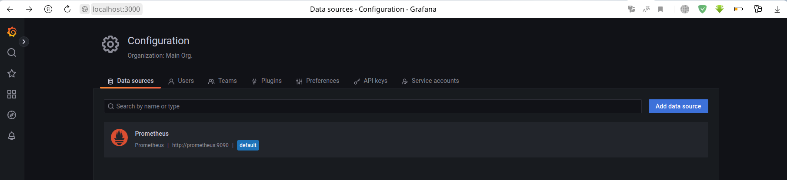
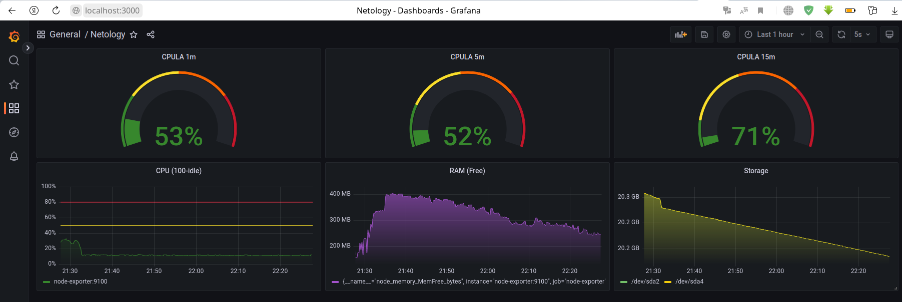
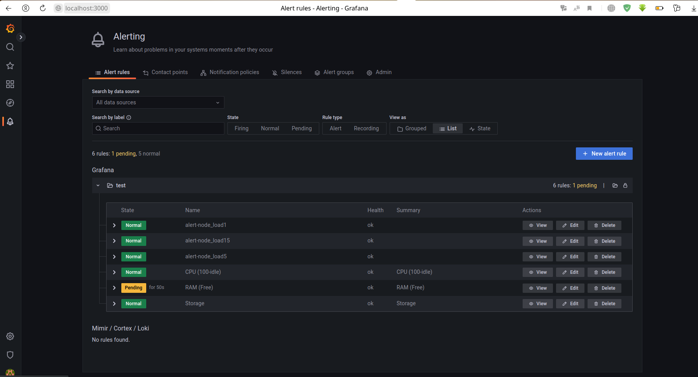

# Домашнее задание к занятию "10.03. Grafana"

## Задание повышенной сложности

**В части задания 1** не используйте директорию [help](./help) для сборки проекта, самостоятельно разверните grafana, где в 
роли источника данных будет выступать prometheus, а сборщиком данных node-exporter:
- grafana
- prometheus-server
- prometheus node-exporter

За дополнительными материалами, вы можете обратиться в официальную документацию grafana и prometheus.

В решении к домашнему заданию приведите также все конфигурации/скрипты/манифесты, которые вы 
использовали в процессе решения задания.

**В части задания 3** вы должны самостоятельно завести удобный для вас канал нотификации, например Telegram или Email
и отправить туда тестовые события.

В решении приведите скриншоты тестовых событий из каналов нотификаций.

## Обязательные задания

### Задание 1
> Используя директорию [help](./help) внутри данного домашнего задания - запустите связку prometheus-grafana.
> 
> Зайдите в веб-интерфейс графана, используя авторизационные данные, указанные в манифесте docker-compose.
> 
> Подключите поднятый вами prometheus как источник данных.
> 
> Решение домашнего задания - скриншот веб-интерфейса grafana со списком подключенных Datasource.



## Задание 2
> Изучите самостоятельно ресурсы:
> - [promql-for-humans](https://timber.io/blog/promql-for-humans/#cpu-usage-by-instance)
> - [understanding prometheus cpu metrics](https://www.robustperception.io/understanding-machine-cpu-usage)
> 
> Создайте Dashboard и в ней создайте следующие Panels:
> - Утилизация CPU для nodeexporter (в процентах, 100-idle)
> - CPULA 1/5/15
> - Количество свободной оперативной памяти
> - Количество места на файловой системе
> 
> Для решения данного ДЗ приведите promql запросы для выдачи этих метрик, а также скриншот получившейся Dashboard.

Метрики для CPULA 1/5/15: `node_load1`, `node_load5`, `node_load15` \
Метрика для утилизации CPU(100-idle): `100 - (avg by (instance) (rate(node_cpu_seconds_total{mode="idle"}[$__rate_interval])) * 100)` \
Метрика для просмотра свободной RAM: `node_memory_MemFree_bytes` \
Метрика для отслеживания места на файловой системе: `sum by(device) (node_filesystem_avail_bytes{fstype!="tmpfs"})`



## Задание 3
> Создайте для каждой Dashboard подходящее правило alert (можно обратиться к первой лекции в блоке "Мониторинг").
> 
> Для решения ДЗ - приведите скриншот вашей итоговой Dashboard.



## Задание 4
> Сохраните ваш Dashboard.
> 
> Для этого перейдите в настройки Dashboard, выберите в боковом меню "JSON MODEL".
> 
> Далее скопируйте отображаемое json-содержимое в отдельный файл и сохраните его.
> 
> В решении задания - приведите листинг этого файла.

```json
{
  "annotations": {
    "list": [
      {
        "builtIn": 1,
        "datasource": {
          "type": "prometheus",
          "uid": "PZhmSrK4k"
        },
        "enable": true,
        "hide": true,
        "iconColor": "rgba(0, 211, 255, 1)",
        "name": "Annotations & Alerts",
        "target": {
          "limit": 100,
          "matchAny": false,
          "tags": [],
          "type": "dashboard"
        },
        "type": "dashboard"
      }
    ]
  },
  "editable": true,
  "fiscalYearStartMonth": 0,
  "graphTooltip": 0,
  "id": 1,
  "links": [],
  "liveNow": false,
  "panels": [
    {
      "datasource": {
        "type": "prometheus",
        "uid": "PZhmSrK4k"
      },
      "fieldConfig": {
        "defaults": {
          "color": {
            "mode": "thresholds"
          },
          "mappings": [],
          "max": 4,
          "min": 0,
          "thresholds": {
            "mode": "absolute",
            "steps": [
              {
                "color": "dark-green",
                "value": null
              },
              {
                "color": "yellow",
                "value": 1
              },
              {
                "color": "dark-orange",
                "value": 2
              },
              {
                "color": "dark-red",
                "value": 3
              }
            ]
          },
          "unit": "percentunit"
        },
        "overrides": []
      },
      "gridPos": {
        "h": 6,
        "w": 8,
        "x": 0,
        "y": 0
      },
      "id": 4,
      "options": {
        "orientation": "auto",
        "reduceOptions": {
          "calcs": [
            "lastNotNull"
          ],
          "fields": "",
          "values": false
        },
        "showThresholdLabels": false,
        "showThresholdMarkers": true,
        "text": {}
      },
      "pluginVersion": "9.3.1",
      "targets": [
        {
          "datasource": {
            "type": "prometheus",
            "uid": "kIcdLk4Vz"
          },
          "editorMode": "code",
          "expr": "node_load1",
          "legendFormat": "__auto",
          "range": true,
          "refId": "A"
        }
      ],
      "title": "CPULA 1m",
      "type": "gauge"
    },
    {
      "datasource": {
        "type": "prometheus",
        "uid": "PZhmSrK4k"
      },
      "fieldConfig": {
        "defaults": {
          "color": {
            "mode": "thresholds"
          },
          "mappings": [],
          "max": 4,
          "thresholds": {
            "mode": "absolute",
            "steps": [
              {
                "color": "dark-green",
                "value": null
              },
              {
                "color": "yellow",
                "value": 1
              },
              {
                "color": "dark-orange",
                "value": 2
              },
              {
                "color": "dark-red",
                "value": 3
              }
            ]
          },
          "unit": "percentunit"
        },
        "overrides": []
      },
      "gridPos": {
        "h": 6,
        "w": 8,
        "x": 8,
        "y": 0
      },
      "id": 6,
      "options": {
        "orientation": "auto",
        "reduceOptions": {
          "calcs": [
            "lastNotNull"
          ],
          "fields": "",
          "values": false
        },
        "showThresholdLabels": false,
        "showThresholdMarkers": true
      },
      "pluginVersion": "9.3.1",
      "targets": [
        {
          "datasource": {
            "type": "prometheus",
            "uid": "kIcdLk4Vz"
          },
          "editorMode": "code",
          "expr": "node_load5",
          "legendFormat": "__auto",
          "range": true,
          "refId": "A"
        }
      ],
      "title": "CPULA 5m",
      "type": "gauge"
    },
    {
      "datasource": {
        "type": "prometheus",
        "uid": "PZhmSrK4k"
      },
      "fieldConfig": {
        "defaults": {
          "color": {
            "mode": "thresholds"
          },
          "mappings": [],
          "max": 4,
          "thresholds": {
            "mode": "absolute",
            "steps": [
              {
                "color": "dark-green",
                "value": null
              },
              {
                "color": "yellow",
                "value": 1
              },
              {
                "color": "dark-orange",
                "value": 2
              },
              {
                "color": "dark-red",
                "value": 3
              }
            ]
          },
          "unit": "percentunit"
        },
        "overrides": []
      },
      "gridPos": {
        "h": 6,
        "w": 8,
        "x": 16,
        "y": 0
      },
      "id": 8,
      "options": {
        "orientation": "auto",
        "reduceOptions": {
          "calcs": [
            "lastNotNull"
          ],
          "fields": "",
          "values": false
        },
        "showThresholdLabels": false,
        "showThresholdMarkers": true
      },
      "pluginVersion": "9.3.1",
      "targets": [
        {
          "datasource": {
            "type": "prometheus",
            "uid": "kIcdLk4Vz"
          },
          "editorMode": "code",
          "expr": "node_load15",
          "legendFormat": "__auto",
          "range": true,
          "refId": "A"
        }
      ],
      "title": "CPULA 15m",
      "type": "gauge"
    },
    {
      "datasource": {},
      "description": "",
      "fieldConfig": {
        "defaults": {
          "color": {
            "mode": "thresholds"
          },
          "custom": {
            "axisCenteredZero": false,
            "axisColorMode": "text",
            "axisLabel": "",
            "axisPlacement": "auto",
            "axisSoftMax": 100,
            "axisSoftMin": 0,
            "barAlignment": 0,
            "drawStyle": "line",
            "fillOpacity": 50,
            "gradientMode": "opacity",
            "hideFrom": {
              "legend": false,
              "tooltip": false,
              "viz": false
            },
            "lineInterpolation": "smooth",
            "lineStyle": {
              "fill": "solid"
            },
            "lineWidth": 1,
            "pointSize": 5,
            "scaleDistribution": {
              "type": "linear"
            },
            "showPoints": "never",
            "spanNulls": false,
            "stacking": {
              "group": "A",
              "mode": "none"
            },
            "thresholdsStyle": {
              "mode": "line"
            }
          },
          "mappings": [],
          "thresholds": {
            "mode": "absolute",
            "steps": [
              {
                "color": "dark-green",
                "value": null
              },
              {
                "color": "yellow",
                "value": 50
              },
              {
                "color": "dark-red",
                "value": 80
              }
            ]
          },
          "unit": "percent"
        },
        "overrides": []
      },
      "gridPos": {
        "h": 7,
        "w": 8,
        "x": 0,
        "y": 6
      },
      "id": 2,
      "options": {
        "legend": {
          "calcs": [],
          "displayMode": "list",
          "placement": "bottom",
          "showLegend": true
        },
        "tooltip": {
          "mode": "single",
          "sort": "none"
        }
      },
      "targets": [
        {
          "datasource": {
            "type": "prometheus",
            "uid": "kIcdLk4Vz"
          },
          "editorMode": "code",
          "expr": " 100 - (avg by (instance) (rate(node_cpu_seconds_total{mode=\"idle\"}[$__rate_interval])) * 100)",
          "legendFormat": "__auto",
          "range": true,
          "refId": "A"
        }
      ],
      "title": "CPU (100-idle)",
      "type": "timeseries"
    },
    {
      "datasource": {},
      "fieldConfig": {
        "defaults": {
          "color": {
            "fixedColor": "semi-dark-purple",
            "mode": "fixed"
          },
          "custom": {
            "axisCenteredZero": false,
            "axisColorMode": "text",
            "axisLabel": "",
            "axisPlacement": "auto",
            "barAlignment": 0,
            "drawStyle": "line",
            "fillOpacity": 67,
            "gradientMode": "opacity",
            "hideFrom": {
              "legend": false,
              "tooltip": false,
              "viz": false
            },
            "lineInterpolation": "smooth",
            "lineWidth": 1,
            "pointSize": 5,
            "scaleDistribution": {
              "type": "linear"
            },
            "showPoints": "never",
            "spanNulls": false,
            "stacking": {
              "group": "A",
              "mode": "none"
            },
            "thresholdsStyle": {
              "mode": "line"
            }
          },
          "mappings": [],
          "thresholds": {
            "mode": "absolute",
            "steps": [
              {
                "color": "green",
                "value": null
              },
              {
                "color": "dark-red",
                "value": 2000000000
              }
            ]
          },
          "unit": "decbytes"
        },
        "overrides": []
      },
      "gridPos": {
        "h": 7,
        "w": 8,
        "x": 8,
        "y": 6
      },
      "id": 10,
      "options": {
        "legend": {
          "calcs": [],
          "displayMode": "list",
          "placement": "bottom",
          "showLegend": true
        },
        "tooltip": {
          "mode": "single",
          "sort": "none"
        }
      },
      "targets": [
        {
          "datasource": {
            "type": "prometheus",
            "uid": "kIcdLk4Vz"
          },
          "editorMode": "code",
          "expr": "node_memory_MemFree_bytes",
          "legendFormat": "__auto",
          "range": true,
          "refId": "A"
        }
      ],
      "title": "RAM (Free)",
      "type": "timeseries"
    },
    {
      "datasource": {
        "type": "prometheus",
        "uid": "PZhmSrK4k"
      },
      "fieldConfig": {
        "defaults": {
          "color": {
            "mode": "palette-classic"
          },
          "custom": {
            "axisCenteredZero": false,
            "axisColorMode": "text",
            "axisLabel": "",
            "axisPlacement": "auto",
            "barAlignment": 0,
            "drawStyle": "line",
            "fillOpacity": 31,
            "gradientMode": "opacity",
            "hideFrom": {
              "legend": false,
              "tooltip": false,
              "viz": false
            },
            "lineInterpolation": "smooth",
            "lineWidth": 1,
            "pointSize": 5,
            "scaleDistribution": {
              "type": "linear"
            },
            "showPoints": "never",
            "spanNulls": false,
            "stacking": {
              "group": "A",
              "mode": "none"
            },
            "thresholdsStyle": {
              "mode": "line"
            }
          },
          "mappings": [],
          "thresholds": {
            "mode": "absolute",
            "steps": [
              {
                "color": "green",
                "value": null
              },
              {
                "color": "dark-red",
                "value": 1000000000
              }
            ]
          },
          "unit": "decbytes"
        },
        "overrides": []
      },
      "gridPos": {
        "h": 7,
        "w": 8,
        "x": 16,
        "y": 6
      },
      "id": 12,
      "options": {
        "legend": {
          "calcs": [],
          "displayMode": "list",
          "placement": "bottom",
          "showLegend": true
        },
        "tooltip": {
          "mode": "single",
          "sort": "none"
        }
      },
      "targets": [
        {
          "datasource": {
            "type": "prometheus",
            "uid": "kIcdLk4Vz"
          },
          "editorMode": "code",
          "expr": "sum by(device) (node_filesystem_avail_bytes{fstype!=\"tmpfs\"})",
          "legendFormat": "__auto",
          "range": true,
          "refId": "A"
        }
      ],
      "title": "Storage",
      "type": "timeseries"
    }
  ],
  "refresh": "5s",
  "schemaVersion": 37,
  "style": "dark",
  "tags": [],
  "templating": {
    "list": []
  },
  "time": {
    "from": "now-1h",
    "to": "now"
  },
  "timepicker": {},
  "timezone": "",
  "title": "Netology",
  "uid": "NIQQaM4Vk",
  "version": 4,
  "weekStart": ""
}
```