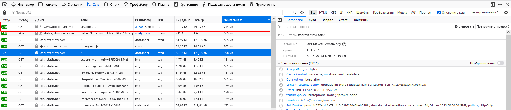
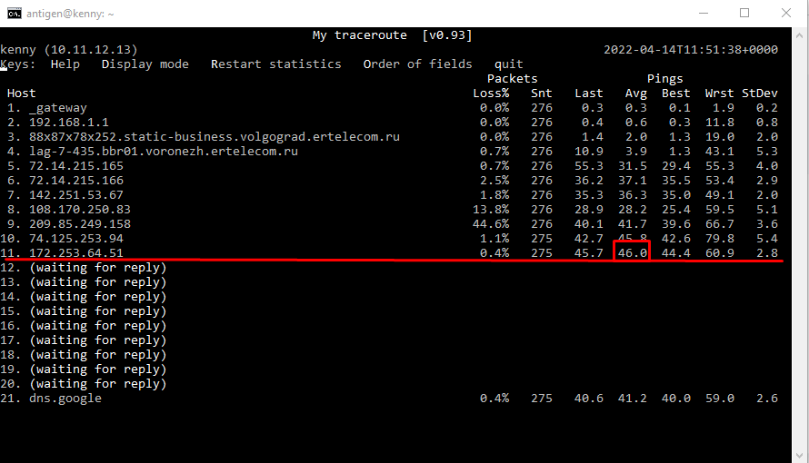

1. 
```bash
antigen@kenny:~$ telnet stackoverflow.com 80
Trying 151.101.193.69...
Connected to stackoverflow.com.
Escape character is '^]'.
GET /questions HTTP/1.0
HOST: stackoverflow.com

HTTP/1.1 301 Moved Permanently
Cache-Control: no-cache, no-store, must-revalidate
Location: https://stackoverflow.com/questions
x-request-guid: e2f84147-b033-4ea0-84ad-916892a96fd3
feature-policy: microphone 'none'; speaker 'none'
content-security-policy: upgrade-insecure-requests; frame-ancestors 'self' https://stackexchange.com
Accept-Ranges: bytes
Date: Thu, 14 Apr 2022 06:43:25 GMT
X-Served-By: cache-hel1410030-HEL
X-Cache: MISS
X-Cache-Hits: 0
X-Timer: S1649918605.175643,VS0,VE109
Vary: Fastly-SSL
X-DNS-Prefetch-Control: off
Set-Cookie: prov=ff824ca6-1d6b-6734-388c-2627c8027324; domain=.stackoverflow.com; expires=Fra, 01-Jan-2055 00:00:00 GMT; path=/; HttpOnly
X-Cache: MISS from router
X-Cache-Lookup: MISS from router:0
Via: 1.1 varnish, 1.1 router (squid/3.3.8)
Connection: close

Connection closed by foreign host.
```

<code>HTTP/1.1 301 Moved Permanently</code> - редирект на порт 443 \
Далее идут заголовки и свойства (директивы): \
<code>Cache-Control: no-cache, no-store, must-revalidate </code> - дерективы кэша: <code>no-cache</code> - не кэшитовать, <code>no-store</code> - не сохранять ответ, <code>must-revalidate</code> - не давать пользователю закэшированный контент. \
<code> Location: https://stackoverflow.com/questions </code> - перенаправление на страницу <code> https://stackoverflow.com/questions </code> \
<code>x-request-guid: e2f84147-b033-4ea0-84ad-916892a96fd3</code> - уникальный идентификатор запроса \
<code>feature-policy: microphone 'none'; speaker 'none'</code> - сообщает политики бразуре: <code>microphone 'none'</code> - микрофон не разрешен на использование, <code>speaker 'none'</code> - воспроизведение звука запрещено \
<code>content-security-policy: upgrade-insecure-requests; frame-ancestors 'self' https://stackexchange.com </code> - политика защиты контента: <code>upgrade-insecure-requests</code> - просит шифрованый ответ (использовать https), <code>frame-ancestors 'self'</code> - разрешает открытие только в собственных фреймах <code> https://stackexchange.com </code> \
<code>Accept-Ranges: bytes</code> - сообщение от том, в каких единицах измерения может запрашиваться фрагмент: <code>bytes</code> - в байтах \
<code>Date: Thu, 14 Apr 2022 06:43:25 GMT</code> - дата и время создания заголовка \
<code>X-Served-By: cache-hel1410030-HEL</code> - идентификатор сервера кэша: <code>cache-hel1410030-HEL</code> сам идентификатор \
<code>X-Cache: MISS</code> - указывает где хранится информация: <code>MISS</code> - указывает, что ищем сначала в кэшэ, если нет, то на сервере \
<code>X-Cache-Hits: 0</code> - указывает количество обращений к кэшу \
<code>X-Timer: S1649918605.175643,VS0,VE109</code> - информация о времени прохождения запроса \
<code>Vary: Fastly-SSL</code> - добавляет указанные заголовки запросов в кэш \
<code>X-DNS-Prefetch-Control: off</code> - отвечает за предварительную обработку DNS \
<code>Set-Cookie: prov=ff824ca6-1d6b-6734-388c-2627c8027324; domain=.stackoverflow.com; expires=Fri, 01-Jan-2055 00:00:00 GMT; path=/; HttpOnly</code> - дает команду клиенту сохранить куки \
<code>X-Cache: MISS from router</code>  - указывает где хранится информация \
<code>X-Cache-Lookup: MISS from router:0</code> - указывает куда смотреть информацию \
<code>Via: 1.1 varnish, 1.1 router (squid/3.3.8)</code> - информирует о прокси серверах, через которые прошел запрос \
<code>Connection: close</code> - соединение закрыто

2. 
 \


3.
```bash
antigen@kenny:~$ wget -qO- ipinfo.io/ip; echo
88.87.74.100
```

4.
Провайдер:
```bash
antigen@kenny:~$ whois `wget -qO- ipinfo.io/ip` | grep descr
descr:          CJSC "ER-Telecom" Company"
descr:          Volgograd, Russia
descr:          PPPoE individual subscribers
descr:          TM DOM.RU, Volgograd ISP
descr:          CJSC "ER-Telecom Holding" Volgograd branch
descr:          Volgograd, Russia
descr:          TM DOM.RU, Volgograd ISP
```
AS:
```bash
antigen@kenny:~$ whois `wget -qO- ipinfo.io/ip` | grep origin
origin:         AS39435
```
5.
```bash
antigen@kenny:~$ traceroute -A 8.8.8.8
traceroute to 8.8.8.8 (8.8.8.8), 30 hops max, 60 byte packets
 1  _gateway (10.11.12.1) [*]  1.111 ms  1.079 ms  1.071 ms
 2  192.168.1.1 (192.168.1.1) [*]  1.173 ms  1.167 ms  1.160 ms
 3  * * *
 4  lag-7-435.bbr01.voronezh.ertelecom.ru (88.87.67.34) [AS39435]  2.428 ms  2.777 ms  2.771 ms
 5  72.14.215.165 (72.14.215.165) [AS15169]  31.967 ms  31.529 ms  29.874 ms
 6  72.14.215.166 (72.14.215.166) [AS15169]  36.449 ms  39.061 ms  39.395 ms
 7  * * *
 8  66.249.95.40 (66.249.95.40) [AS15169]  26.201 ms 108.170.250.129 (108.170.250.129) [AS15169]  26.333 ms 108.170.227.82 (108.170.227.82) [AS15169]  26.189 ms
 9  * 108.170.250.146 (108.170.250.146) [AS15169]  35.229 ms *
10  172.253.66.116 (172.253.66.116) [AS15169]  44.286 ms 209.85.255.136 (209.85.255.136) [AS15169]  43.627 ms *
11  142.251.238.72 (142.251.238.72) [AS15169]  41.840 ms 72.14.238.168 (72.14.238.168) [AS15169]  40.801 ms 142.251.238.66 (142.251.238.66) [AS15169]  38.342 ms
12  216.239.42.21 (216.239.42.21) [AS15169]  44.858 ms 216.239.58.65 (216.239.58.65) [AS15169]  41.158 ms 172.253.51.247 (172.253.51.247) [AS15169]  41.651 ms
13  * * *
14  * * *
15  * * *
16  * * *
17  * * *
18  * * *
19  * * *
20  * * *
21  * * *
22  dns.google (8.8.8.8) [AS15169]  40.382 ms *  40.453 ms
```
6.


7.
DNS:
```bash
antigen@kenny:~$ dig dns.google NS +short
ns2.zdns.google.
ns1.zdns.google.
ns4.zdns.google.
ns3.zdns.google.
```
А записи:
```bash
antigen@kenny:~$ dig dns.google A +short
8.8.8.8
8.8.4.4
```

8.
```bash
antigen@kenny:~$ for i in $(dig dns.google A +short); do dig -x $i +noall +answer | grep arpa; done
8.8.8.8.in-addr.arpa.   5103    IN      PTR     dns.google.
4.4.8.8.in-addr.arpa.   7168    IN      PTR     dns.google.
```
