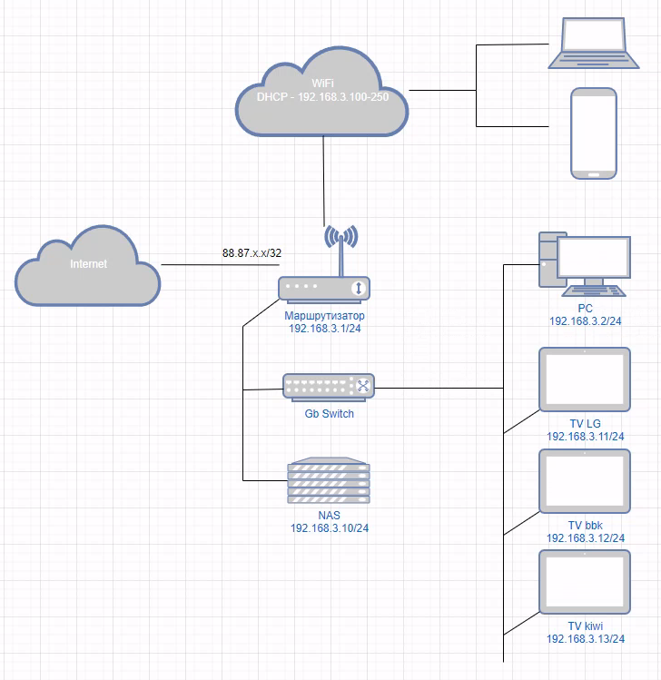

## Компьютерные сети, лекция 3 ##
1. 
```bash
**********************************************************************

                    RouteViews BGP Route Viewer
                    route-views.routeviews.org

 route views data is archived on http://archive.routeviews.org

 This hardware is part of a grant by the NSF.
 Please contact help@routeviews.org if you have questions, or
 if you wish to contribute your view.

 This router has views of full routing tables from several ASes.
 The list of peers is located at http://www.routeviews.org/peers
 in route-views.oregon-ix.net.txt

 NOTE: The hardware was upgraded in August 2014.  If you are seeing
 the error message, "no default Kerberos realm", you may want to
 in Mac OS X add "default unset autologin" to your ~/.telnetrc

 To login, use the username "rviews".

 **********************************************************************

User Access Verification

Username: rviews
route-views>show ip route | include /32
...
B        5.188.83.177/32 [20/0] via 194.85.40.15, 08:19:25
...
route-views>show ip route 5.188.83.177
Routing entry for 5.188.83.177/32
  Known via "bgp 6447", distance 20, metric 0
  Tag 3267, type external
  Last update from 194.85.40.15 08:19:56 ago
  Routing Descriptor Blocks:
  * 194.85.40.15, from 194.85.40.15, 08:19:56 ago
      Route metric is 0, traffic share count is 1
      AS Hops 2
      Route tag 3267
      MPLS label: none
route-views>show bgp 5.188.83.177
BGP routing table entry for 5.188.83.177/32, version 1998187789
Paths: (1 available, best #1, table default)
  Not advertised to any peer
  Refresh Epoch 1
  3267 49505
    194.85.40.15 from 194.85.40.15 (185.141.126.1)
      Origin IGP, metric 0, localpref 100, valid, external, best
      path 7FE189563C68 RPKI State invalid
      rx pathid: 0, tx pathid: 0x0
```
2. Добавляем новый интерфейс:
```bash
antigen@kenny:~$ sudo ip link add dummy0 type dummy
antigen@kenny:~$ sudo ip link set up dummy0
antigen@kenny:~$ ip -br l
lo               UNKNOWN        00:00:00:00:00:00 <LOOPBACK,UP,LOWER_UP>
eth0             UP             00:15:5d:02:01:02 <BROADCAST,MULTICAST,UP,LOWER_UP>
dummy0           UNKNOWN        ea:f3:9f:43:57:5c <BROADCAST,NOARP,UP,LOWER_UP>
antigen@kenny:~$ ip a
1: lo: <LOOPBACK,UP,LOWER_UP> mtu 65536 qdisc noqueue state UNKNOWN group default qlen 1000
    link/loopback 00:00:00:00:00:00 brd 00:00:00:00:00:00
    inet 127.0.0.1/8 scope host lo
       valid_lft forever preferred_lft forever
    inet6 ::1/128 scope host
       valid_lft forever preferred_lft forever
2: eth0: <BROADCAST,MULTICAST,UP,LOWER_UP> mtu 1500 qdisc mq state UP group default qlen 1000
    link/ether 00:15:5d:02:01:02 brd ff:ff:ff:ff:ff:ff
    inet 10.11.12.13/24 brd 10.11.12.255 scope global eth0
       valid_lft forever preferred_lft forever
    inet6 fe80::215:5dff:fe02:102/64 scope link
       valid_lft forever preferred_lft forever
3: dummy0: <BROADCAST,NOARP,UP,LOWER_UP> mtu 1500 qdisc noqueue state UNKNOWN group default qlen 1000
    link/ether ea:f3:9f:43:57:5c brd ff:ff:ff:ff:ff:ff
    inet6 fe80::e8f3:9fff:fe43:575c/64 scope link
       valid_lft forever preferred_lft forever
```
Добавляем статические маршруты:
```bash
antigen@kenny:~$ sudo ip route add 172.16.0.0/24 via 10.11.12.1
antigen@kenny:~$ sudo ip route add 172.16.1.0/24 dev eth0
antigen@kenny:~$ sudo ip route add 172.16.2.0/24 dev eth0 metric 200
antigen@kenny:~$ ip r
default via 10.11.12.1 dev eth0 proto static
10.11.12.0/24 dev eth0 proto kernel scope link src 10.11.12.13
172.16.0.0/24 via 10.11.12.1 dev eth0
172.16.1.0/24 dev eth0 scope link
172.16.2.0/24 dev eth0 scope link metric 200
```
3. 
```bash
antigen@kenny:~$ sudo netstat -lnpt
[sudo] password for antigen:
Active Internet connections (only servers)
Proto Recv-Q Send-Q Local Address           Foreign Address         State       PID/Program name
tcp        0      0 127.0.0.53:53           0.0.0.0:*               LISTEN      673/systemd-resolve
tcp        0      0 0.0.0.0:22              0.0.0.0:*               LISTEN      753/sshd: /usr/sbin
tcp        0      0 127.0.0.1:8125          0.0.0.0:*               LISTEN      697/netdata
tcp        0      0 0.0.0.0:19999           0.0.0.0:*               LISTEN      697/netdata
tcp6       0      0 :::9100                 :::*                    LISTEN      703/node_exporter
tcp6       0      0 :::22                   :::*                    LISTEN      753/sshd: /usr/sbin
```
Ранее создаваемое приложение <code>node_exporter</code> слушает порт <code>9100</code> \
Сервер <code>ssh</code> слушает порт <code>22</code>
4. 
```bash
antigen@kenny:~$ sudo netstat -lnpu
Active Internet connections (only servers)
Proto Recv-Q Send-Q Local Address           Foreign Address         State       PID/Program name
udp        0      0 127.0.0.1:8125          0.0.0.0:*                           697/netdata
udp        0      0 127.0.0.53:53           0.0.0.0:*                           673/systemd-resolve
```
Netdata слушает порт <code>8125</code> \
Внутренний DNS слушает порт <code>53</code>
5.



