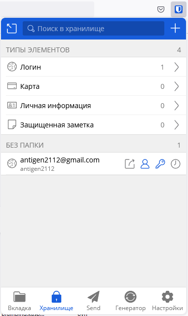
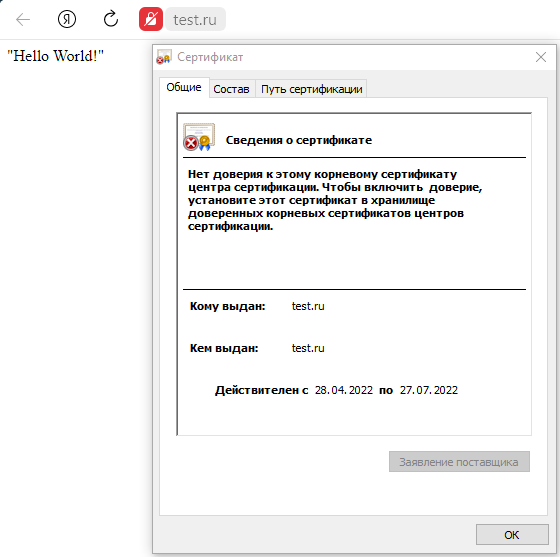

## Элементы безопасности информационных систем ##
1. 
 \
2. 
 \
3.
```bash
root@kenny:/etc/ssl# mkdir apache2
mkdir apache2
root@kenny:/etc/ssl# cd apache2
root@kenny:/etc/ssl/apache2# openssl req -new -x509 -days 90 -nodes -out cert.pem -keyout cert.key -subj "/C=RU/ST=Vlz/L=Vlz/O=Global Security/OU=Netology Stud/CN=test.kenny.local/CN=test.ru"
Generating a RSA private key
....+++++
.....................................................+++++
writing new private key to 'cert.key'
-----
root@kenny:/etc/ssl/apache2# a2enmod ssl
Considering dependency setenvif for ssl:
Module setenvif already enabled
Considering dependency mime for ssl:
Module mime already enabled
Considering dependency socache_shmcb for ssl:
Enabling module socache_shmcb.
Enabling module ssl.
See /usr/share/doc/apache2/README.Debian.gz on how to configure SSL and create self-signed certificates.
To activate the new configuration, you need to run:
  systemctl restart apache2
```
Создаем файл конфигурации сайта:
```bash
root@kenny:/etc/ssl/apache2# cat /etc/apache2/sites-enabled/000-test.conf/sites-enabled/000-test.conf
<VirtualHost *:80>
    ServerName test.ru
    RewriteEngine On
    RewriteCond %{HTTPS} off
    RewriteRule (.*) https://%{HTTP_HOST}%{REQUEST_URI} [R=301,L]
</VirtualHost>

<VirtualHost *:443>
    ServerName test.ru
    DocumentRoot /var/www/test.ru
    SSLEngine on
    SSLCertificateFile /etc/ssl/apache2/cert.pem
    SSLCertificateKeyFile /etc/ssl/apache2/cert.key
</VirtualHost>
```
Проверяем:
```bash
root@kenny:/etc/ssl/apache2# apachectl configtest
AH00112: Warning: DocumentRoot [/var/www/test.ru] does not exist
Syntax OK
```
Создаем каталог и index.html:
```bash
root@kenny:/etc/ssl/apache2# mkdir /var/www/test.ru && chown www-data: /var/www/test.ru
root@kenny:/etc/ssl/apache2# cat /var/www/test.ru/index.html
<!DOCTYPE html>
<html>
<head>
        <title>test.ru</title>
</head>
<body>
        "Hello World!"
</body>
</html>
```
Подключаемся к веб-серверу:
 \
4. 
```bash
antigen@kenny:~/git-rep/testssl.sh$ ./testssl.sh  -U --sneaky https://4pda.to/

###########################################################
    testssl.sh       3.1dev from https://testssl.sh/dev/
    (0329eba 2022-04-27 14:49:02 -- )

      This program is free software. Distribution and
             modification under GPLv2 permitted.
      USAGE w/o ANY WARRANTY. USE IT AT YOUR OWN RISK!

       Please file bugs @ https://testssl.sh/bugs/

###########################################################

 Using "OpenSSL 1.0.2-chacha (1.0.2k-dev)" [~183 ciphers]
 on kenny:./bin/openssl.Linux.x86_64
 (built: "Jan 18 17:12:17 2019", platform: "linux-x86_64")


 Start 2022-04-28 09:41:07        -->> 188.114.96.128:443 (4pda.to) <<--

 Further IP addresses:   2a06:98c1:3120:8000::
 rDNS (188.114.96.128):  --
 Service detected:       HTTP


 Testing vulnerabilities

 Heartbleed (CVE-2014-0160)                not vulnerable (OK), no heartbeat extension
 CCS (CVE-2014-0224)                       not vulnerable (OK)
 Ticketbleed (CVE-2016-9244), experiment.  not vulnerable (OK), no session tickets
 ROBOT                                     not vulnerable (OK)
 Secure Renegotiation (RFC 5746)           OpenSSL handshake didn't succeed
 Secure Client-Initiated Renegotiation     not vulnerable (OK)
 CRIME, TLS (CVE-2012-4929)                not vulnerable (OK)
 BREACH (CVE-2013-3587)                    potentially NOT ok, "gzip" HTTP compression detected. - only supplied "/" tested
                                           Can be ignored for static pages or if no secrets in the page
 POODLE, SSL (CVE-2014-3566)               not vulnerable (OK)
 TLS_FALLBACK_SCSV (RFC 7507)              Downgrade attack prevention supported (OK)
 SWEET32 (CVE-2016-2183, CVE-2016-6329)    VULNERABLE, uses 64 bit block ciphers
 FREAK (CVE-2015-0204)                     not vulnerable (OK)
 DROWN (CVE-2016-0800, CVE-2016-0703)      not vulnerable on this host and port (OK)
                                           make sure you don't use this certificate elsewhere with SSLv2 enabled services
                                           https://censys.io/ipv4?q=EA76309044928A08AF089406E659A08A329B1867A0F9D2AFEE2BBF5D4023EAF8 could help you to find out
 LOGJAM (CVE-2015-4000), experimental      not vulnerable (OK): no DH EXPORT ciphers, no DH key detected with <= TLS 1.2
 BEAST (CVE-2011-3389)                     TLS1: ECDHE-RSA-AES128-SHA AES128-SHA ECDHE-RSA-AES256-SHA AES256-SHA DES-CBC3-SHA
                                           VULNERABLE -- but also supports higher protocols  TLSv1.1 TLSv1.2 (likely mitigated)
 LUCKY13 (CVE-2013-0169), experimental     potentially VULNERABLE, uses cipher block chaining (CBC) ciphers with TLS. Check patches
 Winshock (CVE-2014-6321), experimental    not vulnerable (OK)
 RC4 (CVE-2013-2566, CVE-2015-2808)        no RC4 ciphers detected (OK)


 Done 2022-04-28 09:42:04 [  59s] -->> 188.114.96.128:443 (4pda.to) <<--
```
5. 
```bash
antigen@kenny:~$ ssh-keygen
Generating public/private rsa key pair.
Enter file in which to save the key (/home/antigen/.ssh/id_rsa):
Created directory '/home/antigen/.ssh'.
Enter passphrase (empty for no passphrase):
Enter same passphrase again:
Your identification has been saved in /home/antigen/.ssh/id_rsa
Your public key has been saved in /home/antigen/.ssh/id_rsa.pub
The key fingerprint is:
SHA256:tnnWvMkrp62Ovbu023t71vw7W/v1DjMpdrOCOVDAS+s antigen@kenny
The key's randomart image is:
+---[RSA 3072]----+
|       .         |
|        +        |
|       . +       |
|        o .      |
|       .S.       |
|       .Eo o   . |
|        o.+o= B.+|
|         *=*o=.BX|
|        ..@@O=oO@|
+----[SHA256]-----+
antigen@kenny:~$ ssh
ssh               ssh-agent         ssh-copy-id       ssh-import-id     ssh-import-id-lp  ssh-keyscan
ssh-add           ssh-argv0         sshd              ssh-import-id-gh  ssh-keygen
antigen@kenny:~$ ssh-copy-id antigen@10.11.12.14
/usr/bin/ssh-copy-id: INFO: Source of key(s) to be installed: "/home/antigen/.ssh/id_rsa.pub"
The authenticity of host '10.11.12.14 (10.11.12.14)' can't be established.
ECDSA key fingerprint is SHA256:TxgQwPla+ZN+4annUoyq20IQmXW0yqLwrl8Goo1xyKA.
Are you sure you want to continue connecting (yes/no/[fingerprint])? yes
/usr/bin/ssh-copy-id: INFO: attempting to log in with the new key(s), to filter out any that are already installed
/usr/bin/ssh-copy-id: INFO: 1 key(s) remain to be installed -- if you are prompted now it is to install the new keys
antigen@10.11.12.14's password:

Number of key(s) added: 1

Now try logging into the machine, with:   "ssh 'antigen@10.11.12.14'"
and check to make sure that only the key(s) you wanted were added.

antigen@kenny:~$ ssh antigen@10.11.12.14
Activate the web console with: systemctl enable --now cockpit.socket

Last login: Thu Apr 28 05:46:17 2022
[antigen@localhost ~]$ uname -a
Linux localhost.localdomain 4.18.0-348.20.1.el8_5.x86_64 #1 SMP Thu Mar 10 20:59:28 UTC 2022 x86_64 x86_64 x86_64 GNU/Linux
```
6. 
```bash
antigen@kenny:~$ touch .ssh/config && chmod 600 .ssh/config
antigen@kenny:~$ cat .ssh/config
Host Rocky8.5
        HostName 10.11.12.14
        User antigen
        IdentityFile ~/.ssh/rocky_8.5.key
antigen@kenny:~/.ssh$ mv id_rsa rocky_8.5.key
antigen@kenny:~/.ssh$ mv id_rsa.pub rocky_8.5.pub
antigen@kenny:~/.ssh$ ssh Rocky8.5
Activate the web console with: systemctl enable --now cockpit.socket

Last login: Thu Apr 28 05:48:32 2022 from 10.11.12.13
[antigen@localhost ~]$
```
7. Собираем пакеты:
```bash
antigen@kenny:~$ sudo tcpdump -c 100 -w td.pcap -i eth0
[sudo] password for antigen:
tcpdump: listening on eth0, link-type EN10MB (Ethernet), capture size 262144 bytes
100 packets captured
100 packets received by filter
0 packets dropped by kernel
```
Смотрим пакеты:

8. 
```bash
antigen@kenny:~$ sudo nmap scanme.nmap.org
Starting Nmap 7.80 ( https://nmap.org ) at 2022-04-28 10:31 UTC
Nmap scan report for scanme.nmap.org (45.33.32.156)
Host is up (0.21s latency).
Other addresses for scanme.nmap.org (not scanned): 2600:3c01::f03c:91ff:fe18:bb2f
Not shown: 911 filtered ports, 87 closed ports
PORT   STATE SERVICE
22/tcp open  ssh
80/tcp open  http

Nmap done: 1 IP address (1 host up) scanned in 7.13 seconds
```
Запущены сервисы http и ssh.

9. 
```bash
antigen@kenny:~$ sudo ufw status
Status: inactive
antigen@kenny:~$ sudo ufw default deny incoming
Default incoming policy changed to 'deny'
(be sure to update your rules accordingly)
antigen@kenny:~$ sudo ufw allow OpenSSH
Rules updated
Rules updated (v6)
antigen@kenny:~$ sudo ufw allow http
Rules updated
Rules updated (v6)
antigen@kenny:~$ sudo ufw allow https
Rules updated
Rules updated (v6)
antigen@kenny:~$ sudo ufw app list
Available applications:
  Apache
  Apache Full
  Apache Secure
  OpenSSH
antigen@kenny:~$ sudo ufw enable
Command may disrupt existing ssh connections. Proceed with operation (y|n)? y
Firewall is active and enabled on system startup
antigen@kenny:~$ sudo ufw status
Status: active

To                         Action      From
--                         ------      ----
OpenSSH                    ALLOW       Anywhere
80/tcp                     ALLOW       Anywhere
443/tcp                    ALLOW       Anywhere
OpenSSH (v6)               ALLOW       Anywhere (v6)
80/tcp (v6)                ALLOW       Anywhere (v6)
443/tcp (v6)               ALLOW       Anywhere (v6)
```