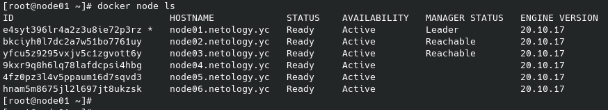
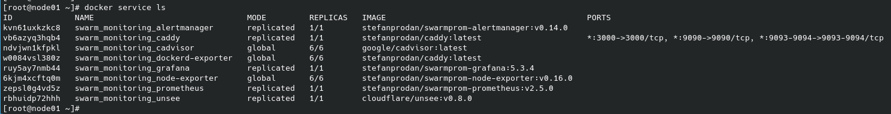
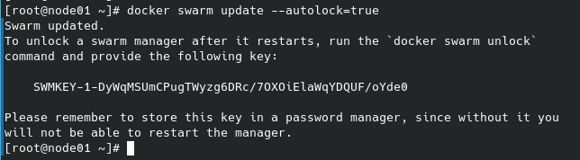

# Домашнее задание к занятию "5.5. Оркестрация кластером Docker контейнеров на примере Docker Swarm"

## Задача 1

Дайте письменые ответы на следующие вопросы:

- В чём отличие режимов работы сервисов в Docker Swarm кластере: replication и global?
- Какой алгоритм выбора лидера используется в Docker Swarm кластере?
- Что такое Overlay Network?

### Ответ

1. В режиме replicated приложение запускается в том количестве экземпляров, какое укажет пользователь. При этом на отдельной ноде может быть как несколько экземпляров приложения, так и не быть совсем. В режиме global приложение запускается обязательно на каждой ноде и в единственном экземпляре.
2. В Docker Swarm кластере используется алгоритм Raft (алгоритм поддержания распределенного консенсуса). Raft предполагает, что на кластере всегда существует явно выделенный лидер. Остальные узлы следуют за лидером и не взаимодействуют между собой. Взаимодействие может происходить только во время фазы выбора лидера.
3. Overlay network - логическая сеть, создаваемая поверх другой сети. В docker swarm - это внутренняя виртуальная сеть кластера, упрощающая взаимодействие узлов кластера между собой.

## Задача 2

Создать ваш первый Docker Swarm кластер в Яндекс.Облаке

Для получения зачета, вам необходимо предоставить скриншот из терминала (консоли), с выводом команды:
```
docker node ls
```

### Ответ
<p align="center">
    
</p>

## Задача 3

Создать ваш первый, готовый к боевой эксплуатации кластер мониторинга, состоящий из стека микросервисов.

Для получения зачета, вам необходимо предоставить скриншот из терминала (консоли), с выводом команды:
```
docker service ls
```

### Ответ
<p align="center">
    
</p>

## Задача 4 (*)

Выполнить на лидере Docker Swarm кластера команду (указанную ниже) и дать письменное описание её функционала, что она делает и зачем она нужна:
```
# см.документацию: https://docs.docker.com/engine/swarm/swarm_manager_locking/
docker swarm update --autolock=true
```

### Ответ
<p align="center">
    
</p>
Данная команда используестся да бОльшей защиты контейнеров. 
Она блокирует <code>swarm manager</code> после перезагрузки. Разблокировать возможно лишь командой <code>docker swarm unlock</code> используя ключ для разблокировки.