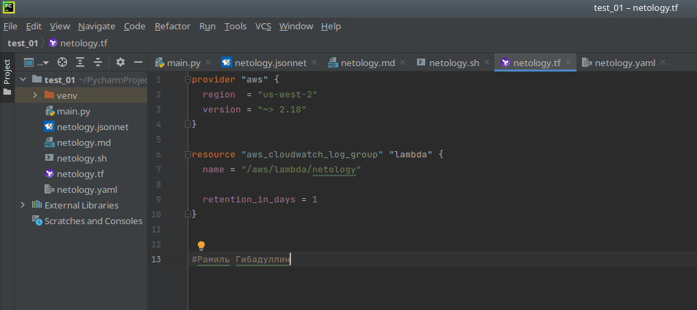
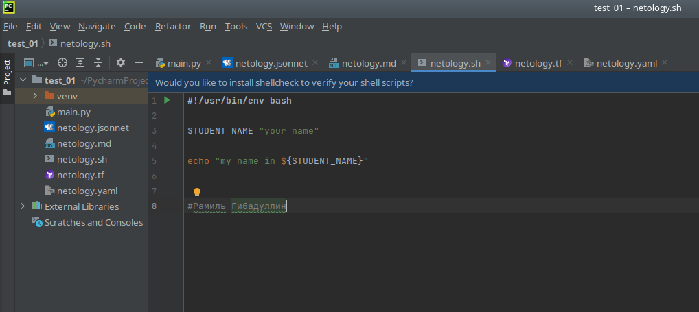
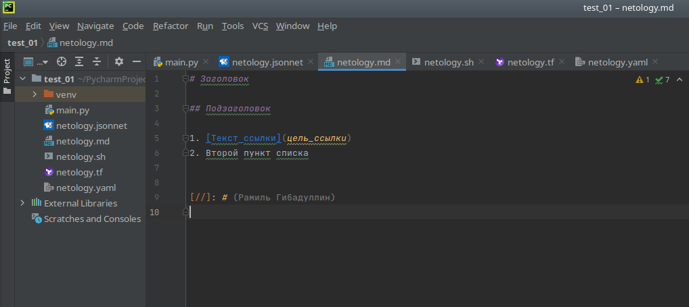
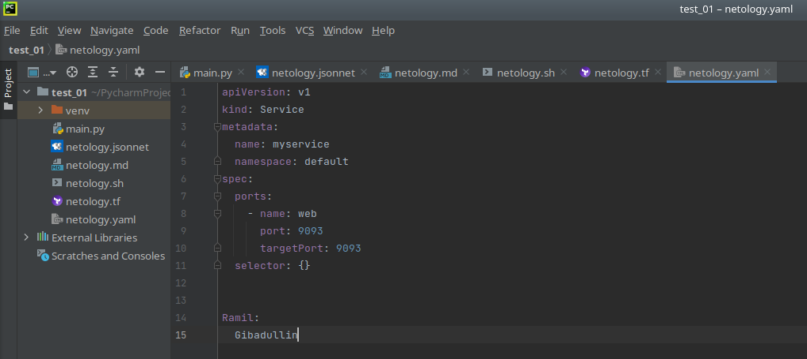

# Задание 1. Подготовка рабочей среды
Скрины подсветки:
1. Terraform: 
2. Bash: 
3. Markdown: 
4. Yaml: 
5. Jsonnet: 

# Задание 2. Описание жизненного цикла задачи.
1. Менеджер связывается с заказчиком. Обсуждают новый функционал, требования. Приходят к некому решению.
2. Менеджер связывается с разработчиками. Вместе разбивают задачу на подзадачи. Создают план работ.
3. Разработчики пишут код. Выдают релиз-кандидат.
4. С моей помощью выкладывают в тестовую среду.
5. Тестировщики прогоняют серию тестов по выявлению недоработок и багов. Если таковые нашлись, то возвращают проект на 3 пункт.
6. Разработчики собирают релиз для продуктивной среды.
7. Я помогаю выкатить новую версию в прод.
8. При возникновении ошибок делаю откат версии и возвращают задачу в 3 пункт.
